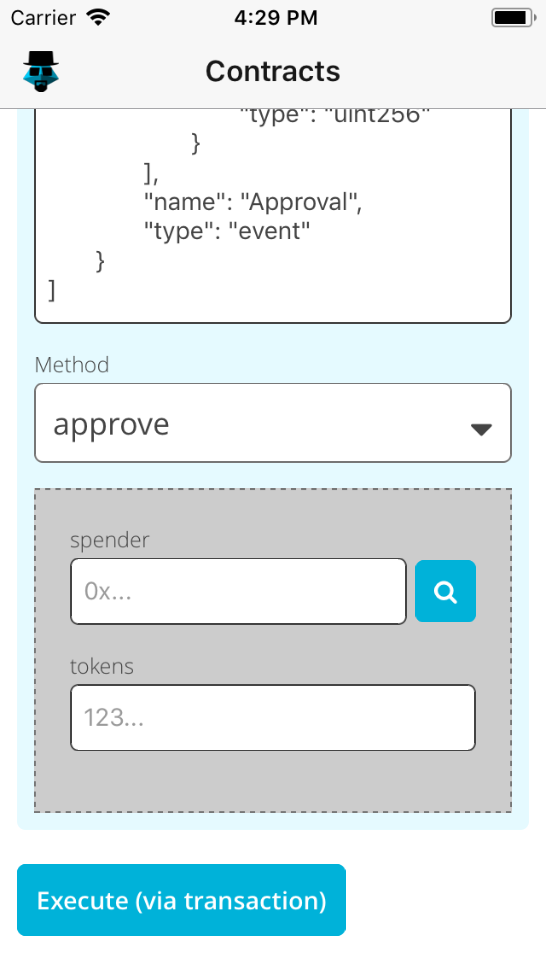

# ethereum-abi-ui

[](http://travis-ci.org/hiddentao/ethereum-abi-ui)
[](https://codecov.io/gh/hiddentao/ethereum-abi-ui)
[](https://twitter.com/hiddentao)

A convenience package that makes it easy to build UIs for interacting with Ethereum contracts.

* Works with with any UI framework
* Field sanitization and validation functions
* Minimal dependencies

Example screenshot (from [Meth](https://github.com/meth/app)):




## Installation

```shell
yarn add ethereum-abi-ui
```

or

```shell
npm install --save ethereum-abi-ui
```

## Example usage

_This is a very basic example to illustrate how you use the API, it only uses jQuery, does not utilize any front-end framework, and is not production-quality code._

```js
import $ from 'jquery'

import {
  FIELD_TYPES,
  canRenderMethodParams,
  renderMethodParams,
  canRenderMethodOutputs,
  renderMethodOutputs
} from 'ethereum-abi-ui'

const ABI = [ /* Solidity contract ABI definition */ ]
const form = $('method')
const output = $('outputs')

const fields = []

// render the input fields for the method params
if (canRenderMethodParams(ABI, 'approve')) {
  renderMethodParams(ABI, 'approve', (name, instance) => {
    switch (instance.fieldType()) {
      case FIELD_TYPES.NUMBER: {
        const input = $(`<input type="number" name="${name}" />`)
        input.instance = instance
        fields.push(input)
        form.append(input)
        break
      }
      case FIELD_TYPES.ADDRESS:
        // ...
        break
      // ...
    }
  })
}

form.submit(() => {
  const values = {}

  fields.forEach(input => {
    // sanitize entered value
    const val = input.instance.sanitize(input.val())

    // check that it's valid
    if (!input.instance.isValid(val)) {
      throw new Error('Please enter valid data')
    }

    // add to final values to send
    values[input.getAttribute('name')] = val
  })

  const results = doWeb3MethodCallUsingFormFieldValues(values)

  // now render the results
  if (canRenderMethodOutputs(ABI, 'approve')) {
    renderMethodOutputs(ABI, 'approve', results, (name, index, instance, result) => {
      output.append(`<p>${name}: ${result}</p>`)
    })
  }
})
```

## API

**canRenderMethodParams(abiJson, methodName): boolean**

Get whether this library can render the input parameters for the given method of the given ABI.

**renderMethodParams(abiJson, methodName, callback)**

Render the input parameters for the given method of the given ABI.

The callback will be called for each input param with the following parameters:

1. `name` - name of the parameter
2. `instance` - an object instance representing the parameter type.

The `instance` object has the following methods:

* `fieldType()` - returns one of the `FIELD_TYPES` (see below)
* `placeholderText()` - suggested placeholder text to use for the input field representing this parameter
* `isValid()` - function which tells you whether a given value is valid for this input parameter
* `sanitize()` - function which can sanitize a given value entered for this parameter

**canRenderMethodOutputs(abiJson, methodName): boolean**

Get whether this library can render the output parameters for the given method of the given ABI.

**renderMethodOutputs(abiJson, methodName, results, callback)**

Render the output parameters for the given method of the given ABI.

The callback will be called for each output param with the following parameters:

1. `name` - name of the parameter
2. `index` - index of the output parameter in the list of outputs
3. `instance` - an object instance representing the parameter type.
4. `result` - the result obtained for this parameter (extracted from the `results` array passed in to the method)

The `instance` object has the following methods:

* `fieldType()` - returns one of the `FIELD_TYPES` (see below)
* `placeholderText()` - suggested placeholder text to use for the input field representing this parameter
* `isValid()` - function which tells you whether a given value is valid for this input parameter
* `sanitize()` - function which can sanitize a given value entered for this parameter

**FIELD_TYPES**

The supported form field types, at present: `ADDRESS`, `TEXT`, `NUMBER`, `BOOL`

**PARAM_TYPES**

The supported variable types, at present: `address`, `string`, `uint`, `int`, `bool`

## Development

* Lint: `yarn lint`
* Test: `yarn test`
* Build: `yarn build`

## Contributors

All contributions welcome. Please see [CONTRIBUTING.md](https://github.com/hiddentao/ethereum-abi-ui/raw/master/CCONTRIBUTING.md)

## License

[MIT](https://github.com/hiddentao/ethereum-abi-ui/raw/master/LICENSE.md)
